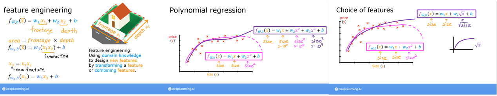

# Feature Engineering and Polynomial Regression

Explore feature engineering and polynomial regression which allows you to use the machinery of linear regression to fit very complicated, even very non-linear functions.

