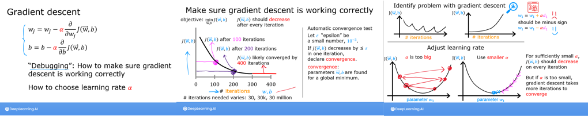
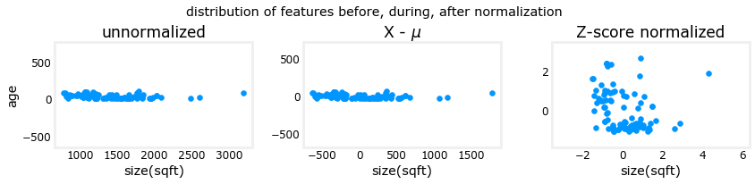

## Feature scaling and Learning Rate (Multi-variable)

Goals
- Utilize  the multiple variables routines developed in the previous lab
- run Gradient Descent on a data set with multiple features
- explore the impact of the *learning rate alpha* on gradient descent
- improve performance of gradient descent by *feature scaling* using z-score normalization

<figure>
    
</figure>

<figure>
    
</figure>

<figure>
    
</figure>

