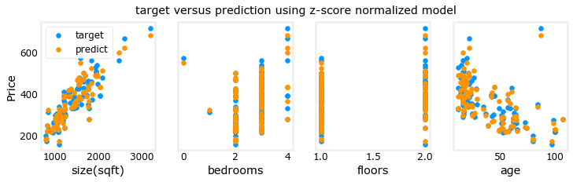

## Linear Regression using Scikit-Learn

Utilize  scikit-learn to implement linear regression using Gradient Descent

There is an open-source, commercially usable machine learning toolkit called [scikit-learn](https://scikit-learn.org/stable/index.html). This toolkit contains implementations of many of the algorithms that you will work with in this course.

<figure>
    
</figure>